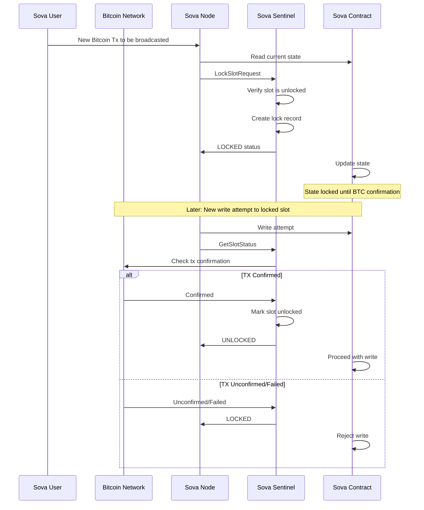

# Sova Sentinel Design

## Overview

Sova Sentinel provides a mechanism to lock storage slots in Sova smart contracts to prevent double-spend attacks. By ensuring data linked to Bitcoin transactions remains immutable until confirmation, it prevents the same Bitcoin transaction from being used multiple times to claim or mint assets on Sova.

## Core Concepts

### Bitcoin Transaction Immutability and Double-Spend Prevention

The primary purpose is to prevent double-spend attacks. When depositing Bitcoin assets to Sova, we need to ensure that:
1. A single Bitcoin transaction cannot be used multiple times to mint or claim assets
2. Data associated with a Bitcoin transaction cannot be modified until the transaction is confirmed
3. State changes can be reverted if the Bitcoin transaction fails to confirm

For example, without locking:
1. User requests to mint uBTC by providing a Bitcoin transaction
2. System starts processing the request to mint uBTC
3. User broadcasts a conflicting transaction on the Bitcoin network
4. This results in uBTC being minted while the original Bitcoin transaction never confirms

Sova Sentinel prevents this by:
1. Locking the relevant storage slot when a Bitcoin transaction is first seen
2. Recording both the current value and a revert value
3. Maintaining this lock until the Bitcoin transaction reaches sufficient confirmation depth
4. Rejecting any attempts to use the same Bitcoin transaction again
5. Providing the ability to revert to the previous state if needed

### Storage Slots

In Sova smart contracts, each contract has its own independent storage space organized as a key-value mapping where:
- Keys are 32-byte unsigned integers (uint256)
- Values are 32-byte values

## Lock Logic

### Lock States

A slot can be in one of two states:
- **Unlocked**: The default state, slot can be locked for a new Bitcoin transaction
- **Locked**: Slot is currently locked and associated with an unconfirmed Bitcoin transaction

### Lock Logic Flow

1. When a new Sova call with Bitcoin transaction data to be broadcasted is received:
   - Client calls `LockSlot` gRPC method with contract address, slot, and Bitcoin transaction details
   - Sentinel verifies the slot is currently unlocked
   - If unlocked, records both current and revert values
   - Creates lock record associating the slot with the Bitcoin transaction
   - Returns success or failure (already locked) status

2. When a new write to a slot is attempted:
   - The slot remains locked
   - Any attempts to modify the slot with other transactions are rejected
   - The system maintains the ability to revert if needed

3. After sufficient confirmations:
   - The lock can be released
   - The state becomes permanent

### Protocol Flow

